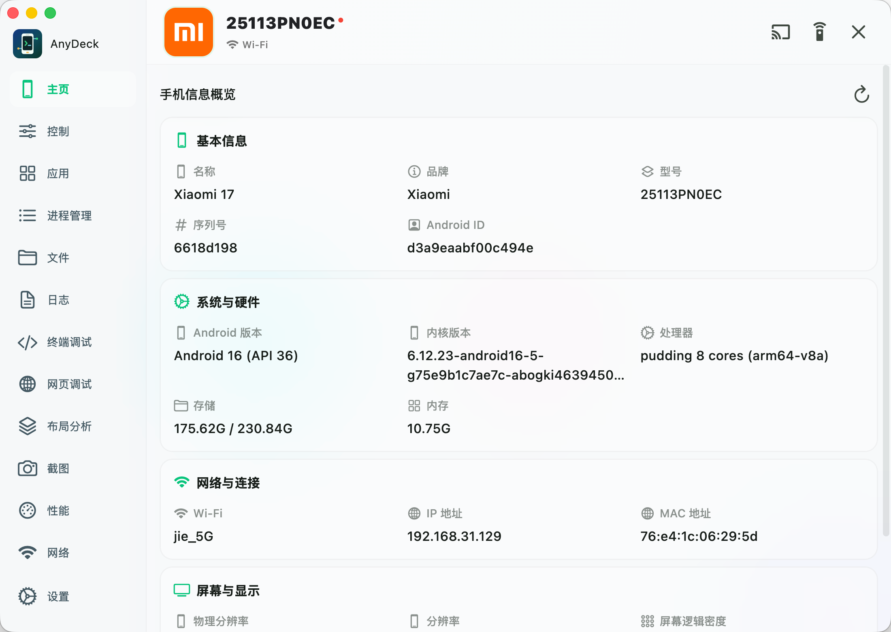
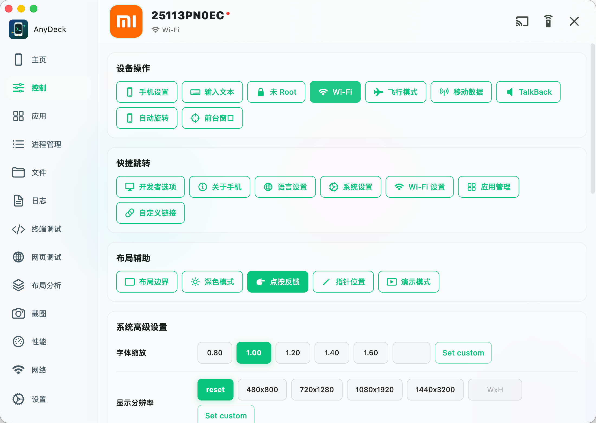
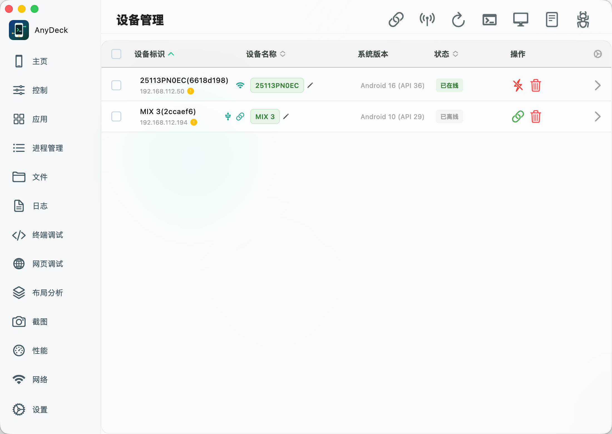
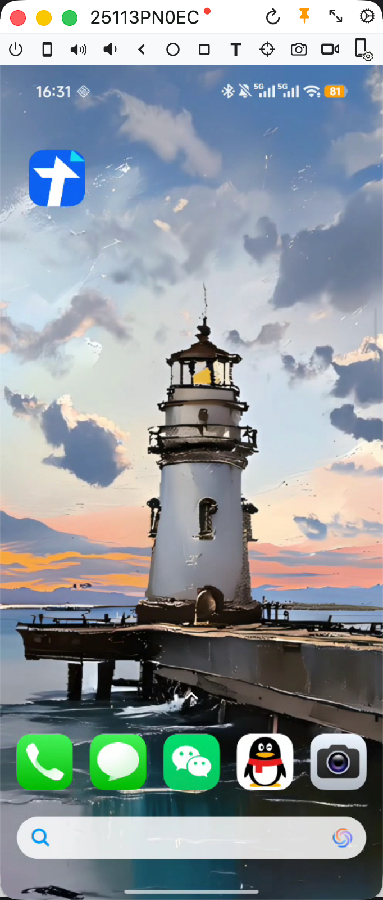
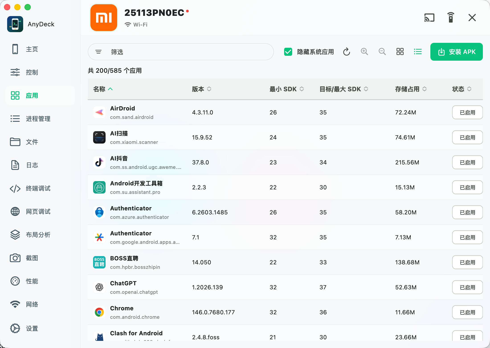
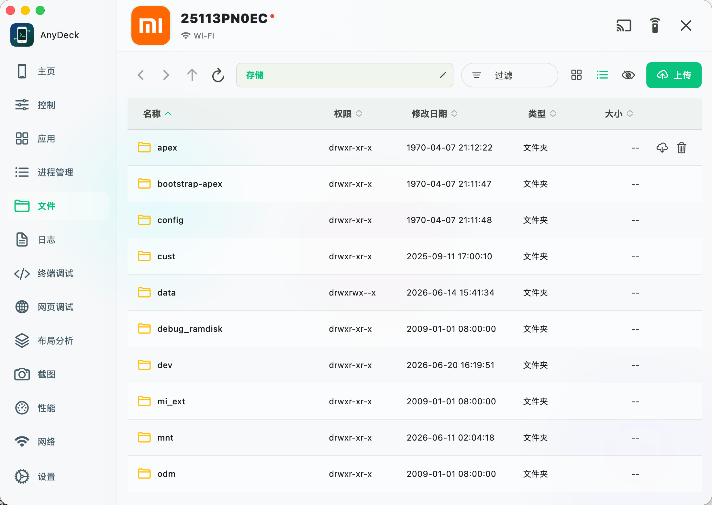
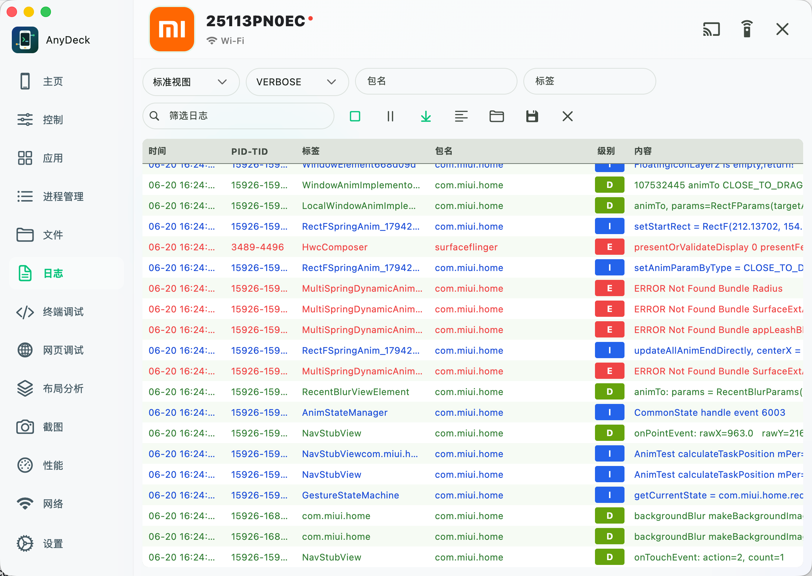
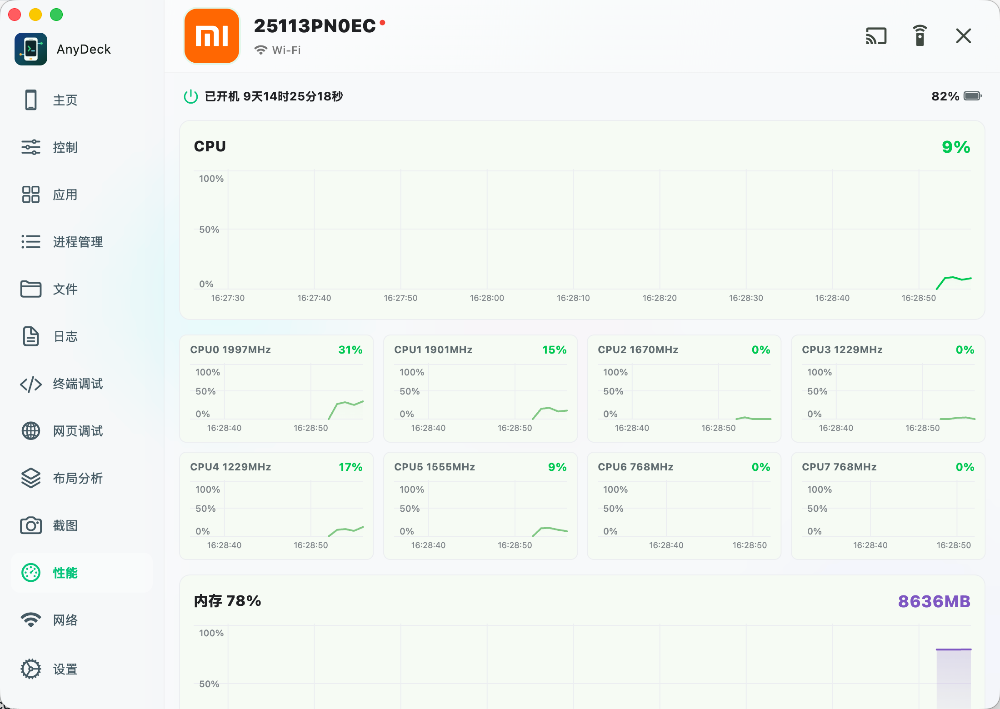
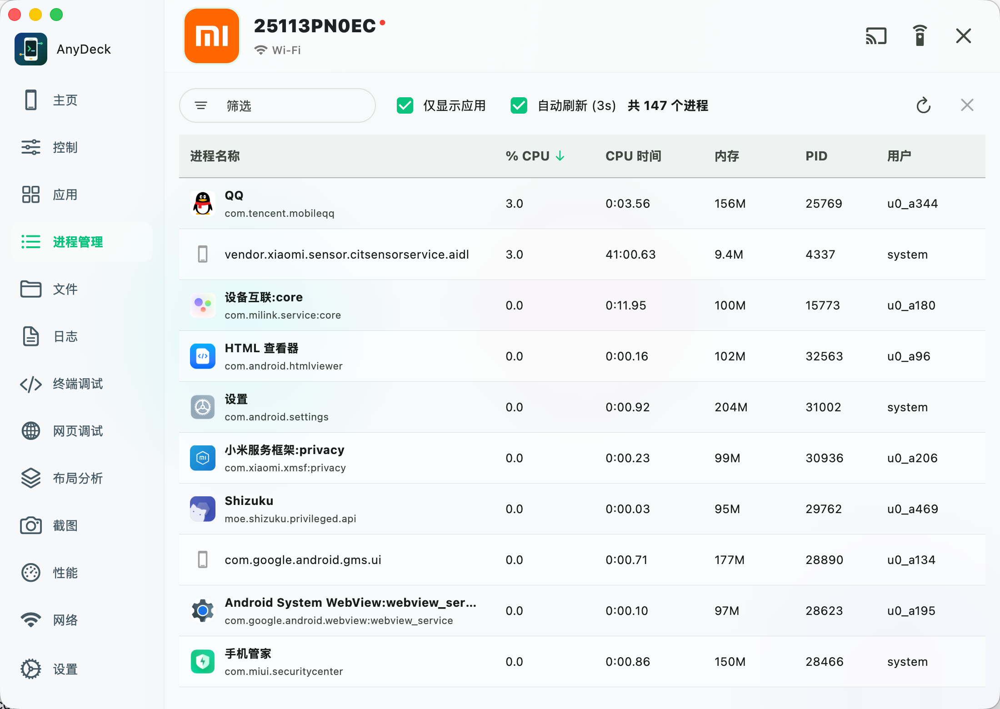

# AnyDeck (AdbManage) 🚀

[](LICENSE)
[](https://flutter.dev)
[](#)

[English Version](README.md) | **简体中文**

AnyDeck 是一个基于 Flutter Desktop 开发的轻量级 Android 调试与辅助工具箱。它将日常 Android 开发和 QA 测试中频繁使用的 ADB 命令及 Scrcpy 投屏功能整合到一个直观的图形界面中，旨在减少重复的手工 CLI 输入，提升多设备联调效率。

---

## 📷 界面截图与演示 (Screenshots & Demos)

| 设备概览 (Overview) | 设备控制 (Device Control) | 设备列表 (Device List) |
| :---: | :---: | :---: |
|  |  |  |
| 屏幕投影 (Screen Mirroring) | 应用管理 (Application Manager) | 文件管理器 (File Manager) |
|  |  |  |
| 实时日志 (Live Logcat) | 性能监控 (Performance Monitor) | 进程管理 (Process Manager) |
|  |  |  |

---

## ✨ 核心特性 (Features)

*   **🔌 设备发现与连接**：通过 USB 或无线方式（TCP/IP、二维码配对、配对码）自动扫描并连接 Android 设备。
*   **💻 实时屏幕投影 (Scrcpy)**：基于外部 Scrcpy 引擎或内置硬解播放器，支持高清、低延迟投屏与逆向控制。
*   **⚙️ 快捷控制中心**：支持文本快速键入、模拟物理按键（Home、Back、Power 等）、Wi-Fi 开关、显示屏旋转及开发者选项快捷切换。
*   **📦 完备的应用管理**：拖拽即可安装 APK，支持应用列表拼音检索、一键清除缓存、冻结/解冻应用、卸载及 APK 备份导出。
*   **🔍 布局分析 (Layout Inspector)**：支持一键获取当前界面布局 XML 树与截图预览，辅助定位界面元素。
*   **📂 简易文件管理**：浏览 `/sdcard/` 目录，支持拖拽文件直接上传、批量下载及快速删除。
*   **📄 实时 Logcat 日志**：一键启停 Logcat 日志流，提供关键字动态过滤与关键日志标记。
*   **🐚 交互式终端 (ADB Shell)**：多标签终端仿真器，支持命令历史记录、常用调试命令快速收藏与一键重置。
*   **🤖 模拟器一键启动**：自动扫描本地 Android 模拟器 (AVD) 并支持一键前台拉起和关闭。

---

## 🛠️ 开发架构 (Architecture)

AnyDeck 采用了声明式的状态管理架构，将 UI 层、业务逻辑与底层 CLI 调用分离：
*   **UI 层 (Flutter Desktop)**：采用响应式与玻璃拟态 (Glassmorphism) 的现代视觉体系，并严格分离组件状态与显示样式。
*   **状态管理 (Riverpod)**：统一管理设备连接会话、后台长连接进程及用户全局配置。
*   **底层交互**：通过 Dart Process 安全封装 `adb` 和 `scrcpy` 命令行调用。
*   **应用包名 (Bundle ID)**：各桌面端的唯一包名均已统一规范为 **`com.github.anydeck`**：
    *   macOS: `com.github.anydeck` (配置于 `macos/Runner/Configs/AppInfo.xcconfig`)
    *   Windows: CompanyName 为 `github` (配置于 `windows/runner/Runner.rc`)
    *   Linux: Application ID 为 `com.github.anydeck` (配置于 `linux/CMakeLists.txt`)

---

## 🚀 快速开始 (Quick Start)

### 1. 运行环境准备
AnyDeck 需要在本地系统中安装必要的工具，建议使用包管理器安装：

#### 🍏 macOS 平台
```bash
# 安装 ADB、FFmpeg 和 Scrcpy 依赖
brew install android-platform-tools ffmpeg scrcpy
```

####  Windows 平台
推荐使用 `Chocolatey` 或 `Scoop` 安装：
```bash
# 使用 Chocolatey
choco install adb ffmpeg scrcpy
```

### 2. 编译与运行
确保本地已经配置好 Flutter SDK（版本推荐 `^3.11.4`）。

```bash
# 1. 获取依赖包
flutter pub get

# 2. 运行开发版
flutter run -d macos  # macOS 平台
# 或者
flutter run -d windows # Windows 平台

# 3. 编译 Release 版本
./script/build_macos.sh # 使用辅助脚本构建并自动拷贝到 Products 目录下
```

---

## 🤝 参与贡献 (Contributing)

我们非常欢迎各种形式的贡献！无论是一起重构代码、修复 Bug，还是提交新的 Feature Request，都可以随时提交 PR。
在提交代码时，请遵守以下约定：
*   新增或重构的代码文件大小尽量控制在 **500 行以内**。
*   尽量将 UI 表现层与核心业务逻辑/服务控制器进行文件级分离。
*   所有的关键代码及处理逻辑请附带详尽的 **中文注释**。
*   项目引入了 [AGENTS.md](AGENTS.md) 作为 AI 编程辅助的约束规则，欢迎参考它来指导你的 AI 开发助手。

---

## 📄 开源许可证与声明 (License & Disclaimers)

*   **许可证**：本项目采用 [Apache-2.0 License](LICENSE) 开源。
*   **第三方依赖**：
    *   `assets/scrcpy/scrcpy-server.jar` 来源于开源项目 [Genymobile/scrcpy](https://github.com/Genymobile/scrcpy) 并遵循其授权协议。
    *   视频硬解基于 [FFmpeg](https://ffmpeg.org) 动态链接库。
*   **商标声明**：项目 `assets/brand/` 目录中所使用的各品牌 Logo（Google, Xiaomi, Huawei 等）均为各自公司的注册商标，本项目仅将其用于设备品牌识别和非商业性功能展示。
