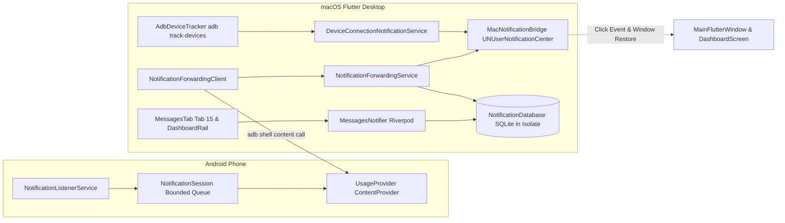

# Android 连接通知与手机消息转发机制

## 1. 概述与设计原则

本项目实现了 Android 设备连接感知与手机实时通知转发到 macOS 桌面的完整端到端链路。
包含：
1. **设备连接通知**：Android 设备连接后发送 macOS 本地通知，点击通知唤起并恢复主窗口至前台，自动定位至该设备概览（Tab 0）。
2. **手机消息转发**：通过 Android 端 Companion (v0.3.0) 的 `NotificationListenerService` 捕获手机普通通知，过滤常驻、进度条、分组汇总和 Companion 自身通知后放入有界环形队列；电脑端通过 ADB `content call` 轮询拉取并持久化至 SQLite，同时发送桌面通知。
3. **离线浏览与上限淘汰**：电脑端在独立 Worker Isolate 中维护 SQLite 数据库，单设备上限 10,000 条，保留 7 天内消息；断开连接后仍可在左侧导航第 15 项（“消息”）查看历史，清空历史同步移除桌面通知。
4. **权限与全局开关**：提供“设备连接通知”与“显示消息正文”全局开关；首次使用检测 macOS 通知权限，若用户拒绝则展示前往“系统设置”的引导，不再无休止弹窗骚扰。

---

## 2. 架构分层设计

### 2.1 链路整体结构

---

## 3. 关键模块实现原理

### 3.1 macOS 原生通知桥接 (`macos/Runner/NotificationBridgeService.swift` & `mac_notification_bridge.dart`)
- 采用 `UNUserNotificationCenter` 原生 API，通知配置 `.banner, .sound, .list`，在应用处于前台时亦可通过 `willPresent` 回调照常展示通知横幅。
- **窗口唤起与聚焦**：
  - 点击通知触发 `userNotificationCenter(_:didReceive:withCompletionHandler:)`。
  - 原生代码调用 `NSApp.activate(ignoringOtherApps: true)`，并针对主窗口执行 `deminiaturize(nil)` 与 `makeKeyAndOrderFront(nil)`，确保无论应用处于全屏、最小化还是后台都能瞬间唤起至用户眼前。
  - 启动阶段设置事件缓冲队列，Flutter 侧调用 `ready()` 完成握手后再冲刷历史点击事件，杜绝冷启动点击丢失。
  - 支持通过 `NSWorkspace.shared.open(URL(string: "x-apple.systempreferences:...")!)` 直达 macOS 系统通知设置。

### 3.2 设备的全局单例监听 (`AdbDeviceTracker`)
- 在主窗口进程内托管唯一的 `adb track-devices -l` 长驻子进程 (`Process.start`)。
- 当窗口隐藏、最小化或切换不同功能 Tab 时保持长连接监听，应用退出时自动销毁进程树。
- `DeviceConnectionNotificationService` 基于设备硬件序列号（Hardware Serial）维护 2s 的连接与断开防抖窗口，过滤无线调试配对探测或短暂重连造成的通知风暴。

### 3.3 Android Companion 通知监听与会话管理 (`tool/usage_companion`)
- **权限与开关**：
  - Android 端申请 `BIND_NOTIFICATION_LISTENER_SERVICE` 系统权限。
  - 用户在 Companion 主界面中提供显式授权跳转按钮和“允许电脑接收手机通知”主控开关（存储于 `SharedPreferences`）。
- **通知过滤策略**：
  - 严格过滤：`FLAG_ONGOING_EVENT`（常驻状态）、进度条通知（`notification.extras.containsKey(Notification.EXTRA_PROGRESS)`）、分组汇总（`FLAG_GROUP_SUMMARY`）以及 Companion 本身包名的通知。
- **单会话租约与有界队列**：
  - `NotificationSession` 采用单会话租约模型，客户端调用 `notification_start_session` 时颁发 `sessionId`。
  - 内存队列限制容量最大 1000 条且 payload 最大 2 MiB，溢出时丢弃最老消息。
  - 消息分配单调递增的 `sequenceId`，轮询提供 `ackSequence` 进行确认消费。租约过期（默认 10 秒无心跳）自动释放内存队列。
  - `UsageProvider` 通过 UID 2000（`Process.SHELL_UID`）鉴权与设备解锁状态验证，杜绝越权访问。

### 3.4 桌面端持久化与多进程隔离 (`NotificationDatabase`)
- 桌面端数据通过 `sqlite3` 存入 SQLite，每次操作在 Worker Isolate 中打开并释放连接，避免阻塞主 UI Isolate。
- **存储限制与自动清理**：
  - 电脑保留最近 7 天通知数据；
  - 单台手机上限 10,000 条通知；每次插入触发阈值检查，自动剔除超出上限或超过 7 天的历史记录。
  - `notification_sources` 持久化 Hardware Serial、ADB route 与 Companion `installationId/androidUserId` 的映射，重启或离线后仍能查询正确历史。
  - 支持按 Companion 来源清空通知，macOS 端按稳定 ID 前缀移除该设备的已交付与待发送通知，不影响其他设备或连接通知。

### 3.5 UI 与交互规范 (`lib/features/messages/`)
- 左侧功能栏新增第 15 项“消息 (Messages)”，无论设备在线或离线均可进入查看。
- 遵循 Riverpod 2.x `NotifierProvider` 架构，UI 与状态逻辑彻底分离。
- 搜索与筛选：支持根据包名筛选、关键字模糊搜索（匹配标题、正文、应用名），点击单条通知高亮动画并自动平滑滚动定位。
- 通知入库和移除后通过 `notificationMessageChangesProvider` 触发列表重新查询；队列返回 `gap=true` 时在消息页展示可能丢失提示。
- 系统通知 payload 使用数字 `targetTab=15`，同时携带 `messageId`、`notificationKey` 与 Hardware Serial；点击时只选择注册表中的真实设备，设备已删除时回到未选择状态并给出提示。
- 严格遵循代码规范：单文件行数 <= 500 行，零无意义格式变动。

---

## 4. 边界条件与回归验证

| 验证场景 | 预期行为 | 验证机制 |
| --- | --- | --- |
| 设备热插拔 | 插入显示系统通知，2s 内快速拔插去重 | `DeviceConnectionNotificationService` 单测覆盖 |
| 首次通知授权 | macOS 状态为 `notDetermined` 时先请求权限，授权成功后发送首次连接通知 | `_FakeMacNotificationBridge` 授权回归测试 |
| Companion 权限未授予 | 消息页顶栏胶囊提示“未开启”，引导前往授权 | 状态机驱动，不产生 Crash 或异常日志 |
| 重启或离线查看 | 使用持久化 serial/route 映射恢复 Companion 来源 | `NotificationDatabase` 来源映射单测覆盖 |
| 7 天过期数据淘汰 | 超过 7 天的数据在下次写入时自动删除 | `NotificationDatabase` 事务级单测验证 |
| 10,000 条上限淘汰 | 超过 10,000 条时按时间戳移除最旧记录 | 数据库插入循环单测验证 |
| macOS 通知点击 | 唤起主窗口，聚焦并跳转到 Tab 0 (连接) 或 Tab 15 (消息) | `NotificationBridgeService.swift` 点击流转发 |
| 消息增量与队列缺口 | 入库后发布刷新事件；`gap=true` 保留缺口状态并显示警告 | `NotificationForwardingService` 回归测试 |
