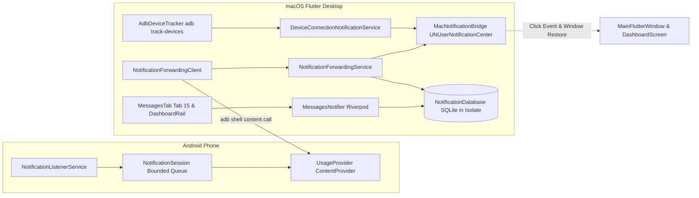

# Android 连接通知与手机消息转发机制

## 1. 概述与设计原则

本项目实现了 Android 设备连接感知与手机实时通知转发到 macOS 桌面的完整端到端链路。
包含：
1. **设备连接通知**：Android 设备连接后发送 macOS 本地通知，点击通知唤起并恢复主窗口至前台，自动定位至该设备概览（Tab 0）。
2. **手机消息转发**：通过 Android 端 Companion (v0.3.0) 的 `NotificationListenerService` 捕获手机普通通知，过滤常驻、进度条、分组汇总和 Companion 自身通知后放入有界环形队列；电脑端通过 ADB `content call` 轮询拉取并持久化至 SQLite，同时发送桌面通知。
3. **离线浏览与上限淘汰**：电脑端在独立 Worker Isolate 中维护 SQLite 数据库，单设备上限 10,000 条，保留 7 天内消息；断开连接后仍可在左侧导航第 15 项（“消息”）查看历史，清空历史同步移除桌面通知。
4. **权限与全局开关**：提供“设备连接通知”与“显示消息正文”全局开关；首次使用检测 macOS 通知权限，若用户拒绝则展示前往“系统设置”的引导，不再无休止弹窗骚扰。

---

## 2. 架构分层设计

### 2.1 链路整体结构



---

## 3. 关键模块实现原理

### 3.1 macOS 原生通知桥接 (`macos/Runner/NotificationBridgeService.swift` & `mac_notification_bridge.dart`)
- 采用 `UNUserNotificationCenter` 原生 API，通知配置 `.banner, .sound, .list`，在应用处于前台时亦可通过 `willPresent` 回调照常展示通知横幅。
- **窗口唤起与聚焦**：
  - 点击通知触发 `userNotificationCenter(_:didReceive:withCompletionHandler:)`。
  - 原生代码调用 `NSApp.activate(ignoringOtherApps: true)`，并针对主窗口执行 `deminiaturize(nil)` 与 `makeKeyAndOrderFront(nil)`，确保无论应用处于全屏、最小化还是后台都能瞬间唤起至用户眼前。
  - 启动阶段设置事件缓冲队列，Flutter 侧调用 `ready()` 完成握手后再冲刷历史点击事件，杜绝冷启动点击丢失。
- 支持通过 `NSWorkspace.shared.open(URL(string: "x-apple.systempreferences:...")!)` 直达 macOS 系统通知设置。
- **手机 App 图标附件**：转发服务从现有 `packagesProvider(deviceId)` 读取 `iconLocalPath`，通过 `showNotification` MethodChannel 传给原生端。原生端校验 PNG 文件和 10 MiB 上限，复制临时文件并创建 `UNNotificationAttachment`，保留原始图标缓存；通知提交后清理临时副本。图标缺失或附件创建失败时继续发送文字通知。macOS 左侧仍使用 AnyDeck 的 Bundle 图标，手机 App 图标由系统作为右侧图片附件展示，具体布局由系统控制。

### 3.2 设备的全局单例监听 (`AdbDeviceTracker`)
- 在主窗口进程内托管唯一的 `adb track-devices -l` 长驻子进程 (`Process.start`)。
- 当窗口隐藏、最小化或切换不同功能 Tab 时保持长连接监听，应用退出时自动销毁进程树。
- `DeviceConnectionNotificationService` 基于设备硬件序列号（Hardware Serial）维护 2s 的连接与断开防抖窗口，过滤无线调试配对探测或短暂重连造成的通知风暴。

### 3.3 Android Companion 通知监听与会话管理 (`tool/usage_companion`)
- **权限与开关**：
  - Android 端申请 `BIND_NOTIFICATION_LISTENER_SERVICE` 系统权限。
  - 用户在 Companion 主界面中提供显式授权跳转按钮和“允许电脑接收手机通知”主控开关（存储于 `SharedPreferences`）。
- **通知过滤策略**：
  - 严格过滤：`FLAG_ONGOING_EVENT`（常驻状态）、进度条通知（`notification.extras.containsKey(Notification.EXTRA_PROGRESS)`）、分组汇总（`FLAG_GROUP_SUMMARY`）以及 Companion 本身包名的通知。
- **单会话租约与有界队列**：
  - `NotificationSession` 采用单会话租约模型，客户端调用 `notification_start_session` 时颁发 `sessionId`。
  - 内存队列限制容量最大 1000 条且 payload 最大 2 MiB，溢出时丢弃最老消息。
  - 消息分配单调递增的 `sequenceId`，轮询提供 `ackSequence` 进行确认消费。租约过期（默认 10 秒无心跳）自动释放内存队列。
  - `UsageProvider` 通过 UID 2000（`Process.SHELL_UID`）鉴权与设备解锁状态验证，杜绝越权访问。

### 3.4 桌面端持久化与多进程隔离 (`NotificationDatabase`)
- 桌面端数据通过 `sqlite3` 存入 SQLite，每次操作在 Worker Isolate 中打开并释放连接，避免阻塞主 UI Isolate。
- **存储限制与自动清理**：
  - 电脑保留最近 7 天通知数据；
  - 单台手机上限 10,000 条通知；每次插入触发阈值检查，自动剔除超出上限或超过 7 天的历史记录。
  - `notification_sources` 持久化 Hardware Serial、ADB route 与 Companion `installationId/androidUserId` 的映射，重启或离线后仍能查询正确历史。
  - 支持按 Companion 来源清空通知，macOS 端按稳定 ID 前缀移除该设备的已交付与待发送通知，不影响其他设备或连接通知。

### 3.5 UI 与交互规范 (`lib/features/messages/`)
- 左侧功能栏新增第 15 项“消息 (Messages)”，无论设备在线或离线均可进入查看。
- 遵循 Riverpod 2.x `NotifierProvider` 架构，UI 与状态逻辑彻底分离。
- 搜索与筛选：支持根据包名筛选、关键字模糊搜索（匹配标题、正文、应用名），点击单条通知高亮动画并自动平滑滚动定位。
- 通知入库和移除后通过 `notificationMessageChangesProvider` 触发列表重新查询；队列返回 `gap=true` 时在消息页展示可能丢失提示。
- 系统通知 payload 使用数字 `targetTab=15`，同时携带 `messageId`、`notificationKey` 与 Hardware Serial；点击时只选择注册表中的真实设备，设备已删除时回到未选择状态并给出提示。
- 严格遵循代码规范：单文件行数 <= 500 行，零无意义格式变动。

---

## 4. 边界条件与回归验证

| 验证场景 | 预期行为 | 验证机制 |
| --- | --- | --- |
| 设备热插拔 | 插入显示系统通知，2s 内快速拔插去重 | `DeviceConnectionNotificationService` 单测覆盖 |
| 首次通知授权 | macOS 状态为 `notDetermined` 时先请求权限，授权成功后发送首次连接通知 | `_FakeMacNotificationBridge` 授权回归测试 |
| Companion 权限未授予 | 消息页顶栏胶囊提示“未开启”，引导前往授权 | 状态机驱动，不产生 Crash 或异常日志 |
| 重启或离线查看 | 使用持久化 serial/route 映射恢复 Companion 来源 | `NotificationDatabase` 来源映射单测覆盖 |
| 7 天过期数据淘汰 | 超过 7 天的数据在下次写入时自动删除 | `NotificationDatabase` 事务级单测验证 |
| 10,000 条上限淘汰 | 超过 10,000 条时按时间戳移除最旧记录 | 数据库插入循环单测验证 |
| macOS 通知点击 | 唤起主窗口，聚焦并跳转到 Tab 0 (连接) 或 Tab 15 (消息) | `NotificationBridgeService.swift` 点击流转发 |
| 手机 App 图标 | 有缓存时转发通知附带对应图标，未缓存时仍正常显示文字通知 | `NotificationForwardingService` 参数回归测试；右侧附件样式需在 Notification Center 手工验收 |
| 消息增量与队列缺口 | 入库后发布刷新事件；`gap=true` 保留缺口状态并显示警告 | `NotificationForwardingService` 回归测试 |

## 5. 多设备消息来源标识（2026-09-30）

### 5.1 展示与身份规则

- macOS 手机消息通知的 Title 为 `设备名 · 短标识 · 应用名`，新增可选 Subtitle 承载原消息标题，Body 继续遵循正文预览开关。连接通知没有 Subtitle 时仍保持原行为。
- 消息页仍按当前设备查询；页头和每条卡片共用 `MessageDeviceBadge` 显示来源。页头区分在线监听、在线未监听、离线历史；清空按钮与确认文案明确当前设备范围。
- `notification_device_identity.dart` 复用注册表 `displayName`（备注优先，其次有效型号），名称缺失回退至快照或中英文 Android 设备文案。稳定身份优先 Hardware Serial，网络 route 不充当持久身份；缺少 Serial 时使用 `installation:<installationId>`。
- 来源标签始终附带尾部短标识，从 4 位起，在已知注册设备间发生尾码冲突时延长；包含离线注册设备参与消歧。USB/Wi-Fi 通过同一 Hardware Serial 保持身份一致。
- 身份显示通过现有注册表与 SQLite 读取，无额外 ADB 查询，无新增依赖或子窗口。新增标签使用主题色，文案维护于中英文 messages 表。

### 5.2 持久化与兼容

- SQLite 新增 `notification_source_metadata` 表，主键 `(installation, user_id)`，保存 `device_id` 和 `device_name` 快照；保留原 notifications 表和来源别名表，不清空旧数据。
- 会话握手、收到消息以及消息页状态刷新时补齐元数据。`resolveSource()` 左连接元数据，旧库没有快照时仍可查询原历史；当前注册表可用于显示旧来源名称。
- Companion 重装或网络地址复用只更新别名指向，旧来源元数据独立保留；`readSource()` 可按通知原始来源恢复快照。改名后界面优先使用注册表当前名称，新通知更新名称快照。
- 历史仍保留 7 天、每来源 10,000 条；屏蔽、清空和 macOS 通知 ID 继续按原来源隔离。Android Companion 协议未变。

### 5.3 点击定位与设备切换

- 手机通知 payload 增加 `installationId`、`androidUserId`，`deviceSerial` 使用稳定身份。
- `notification_click_target.dart` 优先核验 Hardware Serial。有明确 Serial 却找不到对应设备时，不允许用旧 IP 匹配另一台手机；没有 Serial 时用持久化安装来源及 Android 用户核验设备。旧版通知仍兼容既有 route 路径。
- 点击时清除搜索/应用筛选，保存来源目标与 messageId；以来源和 ID 双重条件补查最近 200 条之外的目标消息。列表使用以目标为原点的 SliverList，目标立即可见，向上仍可查看较新消息。原始来源与手机当前安装/用户不同时提供返回当前消息入口。
- `MessagesTab.didUpdateWidget` 在设备变化时清理状态并递增请求代次；异步状态回调、数据库写入与 Provider 更新前校验代次，避免 A 的迟到结果覆盖 B。
- 设备已删除时沿用回到设备列表并提示的行为；过期或已清空消息不能恢复正文，显示对应来源剩余历史。

### 5.4 本次验证与手工验收边界

定向自动测试覆盖数据库升级、来源快照、重装与 route 复用、双设备相同消息隔离、正文隐藏、MethodChannel Subtitle、点击来源核验、设备切换迟到回调以及明暗主题下目标定位。

```bash
flutter test --no-pub test/notification_database_test.dart test/notification_forwarding_test.dart test/notification_device_identity_test.dart test/notification_click_target_test.dart test/messages_source_widget_test.dart test/mac_notification_bridge_test.dart
```

- 本次 28 项定向测试通过；消息模块定向 Dart analyze 无问题；Swift 桥接文件语法检查通过。Dashboard 检查仅保留 HEAD 已存在的 `liquid_glass_background.dart` 未使用 import 警告，未混入无关清理。未启动桌面项目、未执行整机或完整 macOS 构建验收。
- 手工验收：两台同型号手机同时发相同通知；修改备注后再发消息；USB/Wi-Fi 切换；离线重启查看历史；查看 A 时点击 B 的通知；关闭正文预览；清空 A 不影响 B。
- macOS 横幅 Subtitle、附件布局及系统截断行为受系统版本与通知设置影响，需 Notification Center 实机验收。
