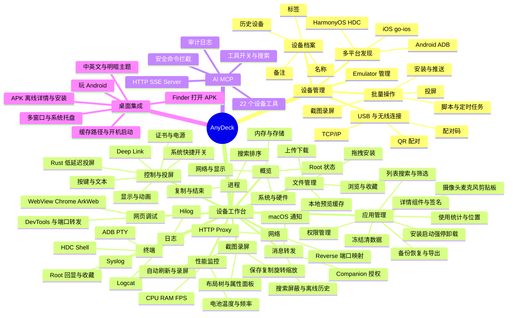

# AnyDeck 当前功能清单与思维导图

> 整理日期：2026-09-19
>
> 范围：以当前仓库的主导航、业务代码及 `agent/knowledge/` 为准；本次只做静态梳理，未启动软件或连接真机验证。

## 一、产品定位

AnyDeck（AdbManage）是一款基于 Flutter Desktop 的多设备调试与管理工具。它以 Android ADB 为核心，同时接入 HarmonyOS NEXT HDC、iOS go-ios/WDA，并通过纯 Rust 设备会话底座提供低延迟投屏、控制、摄像头、麦克风和剪贴板能力。

## 二、当前功能清单

### 1. 设备管理

- 自动发现 Android、HarmonyOS NEXT、iOS 设备，展示在线、未授权和离线状态。
- 支持 USB、ADB TCP/IP、二维码无线配对、配对码连接及手动地址连接。
- 按硬件序列号合并 USB/Wi-Fi 双通道，保留设备名称、备注、标签和历史记录。
- 提供设备连接、断开、删除、投屏等快捷操作。
- 支持批量投屏、截图、录屏、安装 APK、推送文件、执行脚本和定时任务。
- 内置 Android Emulator 管理，可扫描、筛选、启动、关闭和查看 AVD 配置，并支持独立子窗口。

### 2. 设备概览

- 展示设备名称、品牌、型号、序列号、Android ID、系统/API 版本及厂商系统版本。
- 展示 CPU、内存、存储、分辨率、密度、刷新率、网络 IP/MAC 等信息。
- 展示 Android Root 状态；属性值支持点击复制。
- 内存卡可跳转进程管理，存储卡可跳转文件管理。
- 使用本地缓存实现快速展示，设备在线后异步刷新。

### 3. 设备控制与投屏

- 支持文本输入、Home、Back、Power、音量等按键控制及远程控制器。
- 支持通知栏、快捷设置展开，以及 Wi-Fi、飞行模式、移动数据、TalkBack、自动旋转切换。
- 提供开发者选项、Wi-Fi、系统设置、设备信息、语言、应用管理等 Deep Link 快捷入口。
- 支持字体缩放、显示密度、深浅色、布局边界、触摸点、指针位置、Demo Mode、GPU 渲染及动画倍率调节。
- 支持读取已保存 Wi-Fi 密码（依赖 Root）、导入用户证书和系统证书（系统证书依赖 Root）。
- 支持普通重启、Recovery、Bootloader、Sideload 等电源操作。
- 独立投屏窗口支持视频、音频、触控、键盘、滚轮、双向剪贴板、息屏投屏、置顶、应用投屏及鼠标轨迹录制/回放。
- macOS 使用 Rust + VideoToolbox + Metal Texture + AudioQueue；其他平台能力按底层实现与设备环境降级。

### 4. 应用管理

- 支持用户应用、系统应用、全部应用和 DEBUG 应用筛选，提供搜索历史、列表/网格视图及应用收藏。
- 支持 APK 拖拽安装、文件选择安装、启动、强停、清除数据、冻结/解冻、卸载、打开系统详情、导出 APK。
- 支持应用数据备份与恢复；Android 版本、debuggable 状态和 Root 权限会影响可用策略。
- 展示版本、SDK、占用、安装路径、原生库、Service、Activity、Receiver、Provider、Permission、Metadata、DEX 等详情。
- 展示当前/历史签名证书、X.509 字段及 MD5、SHA-1、SHA-256 指纹。
- 支持权限分类、单项授权/撤销和批量撤销后回读确认。
- Companion 能力包含使用统计、位置历史与地图；设备辅助能力包含前后摄像头预览、麦克风监听和手机剪贴板。
- Wi-Fi 与 USB 连接共享应用列表和图标缓存，切换通道时优先复用已缓存数据。

### 5. 文件管理

- 支持目录浏览、表格/网格视图、前进后退、面包屑、路径输入和隐藏文件显示。
- 提供 Internal Storage、DCIM、Download、Pictures、Music、Movies、Documents 等快捷目录及设备级收藏夹。
- 支持创建、重命名、删除、上传、下载和桌面拖拽上传。
- 双击或按 Space 可将文件拉取到本地预览缓存，再交给系统默认应用打开；支持取消和缓存复用。
- APK 拖入 Android 设备时执行安装；HAP/HSP 拖入 HarmonyOS NEXT 设备时执行安装。

### 6. 日志、终端与进程

- Logcat/Hilog/Syslog：实时日志、级别/Tag/包名/关键词过滤、暂停、清空和导出，并限制内存缓存长度。
- Terminal：交互式 ADB PTY 或 HDC Shell，展示设备真实命令回显、目录和 Root 提示符，支持常用命令收藏。
- Processes：进程快照、搜索、排序、复制进程名、强停应用或结束 PID；iOS 通过 go-ios instruments 进程服务读取和终止应用进程。

### 7. 网页调试

- 扫描 Android WebView、Chrome 或 HarmonyOS ArkWeb 的 DevTools Socket。
- 自动建立 ADB/HDC 端口转发，读取调试目标列表。
- 支持在 Chrome 中打开 DevTools，或使用系统浏览器打开原始 URL。
- 离开页面或设备断开时自动清理临时端口映射。

### 8. 截图、录屏与布局分析

- 支持截图刷新、保存、复制、旋转、缩放、1:1、自动刷新和录屏。
- 布局分析整合在截图录屏页，可同步获取截图和 UI XML 树。
- 提供控件树、截图画布、属性面板三栏视图，支持树节点与画面元素双向选中。
- 支持控件边界显示、px/dp 切换、节点展开/折叠，以及 PNG + XML 联合导出。

### 9. 性能与网络

- 性能监控展示整体/单核 CPU、频率、RAM、前台应用 FPS、电量、温度、充电状态和开机时间。
- 网络工具支持读取、设置和清除 Android 系统 HTTP Proxy。
- 支持 ADB Reverse 端口映射、预设管理和设备上线后自动应用。

### 10. 手机消息转发

- 通过 Android Companion 的 NotificationListenerService 采集用户授权的通知。
- 将通知同步到 macOS Notification Center，并尽量附带手机应用图标。
- 支持转发开关、授权状态、消息搜索、应用筛选、屏蔽名单、历史清理和离线历史查看。
- 使用本地 SQLite 保存来源映射与消息记录，并设置有界队列和自动清理策略。

### 11. AI MCP 服务

- 内置 HTTP SSE MCP Server，支持 `initialize`、`tools/list`、`tools/call` 和 `ping`。
- 当前注册 22 个工具，覆盖设备信息、截图/UI 树、点击/滑动/文本/按键、应用、日志、文件和 Shell。
- 支持服务启停、端口配置、工具分类与搜索、逐工具启用/禁用、客户端配置复制及调用审计日志。
- 对卸载、清数据、自定义 Shell 等高风险工具进行标识，并拦截已知破坏性命令。

### 12. iOS 与 HarmonyOS NEXT 适配

- iOS：支持概览、WDA 点击/滑动自动化、应用安装/卸载、AFC 文件操作、Syslog、应用进程、截图和 go-ios USB 投屏。
- HarmonyOS NEXT：支持概览、控制、应用、文件、Hilog、终端、进程、ArkWeb 调试、截图和 HDC 投屏。
- Android 专属主导航能力：性能监控、HTTP Proxy/ADB Reverse、消息转发和布局分析。

### 13. 桌面与全局能力

- 支持 macOS、Windows、Linux Desktop；提供系统托盘、主窗口隐藏/恢复和多窗口管理。
- 独立子窗口包括投屏、模拟器管理、本地 APK 详情、Android 版本分布等。
- macOS Finder 可直接打开 APK，离线解析包信息和签名，并转交主窗口选择设备安装。
- 提供中英文、跟随系统/浅色/深色主题、截图录屏路径、缓存、开机启动、通知权限和投屏参数设置。
- 内置“玩 Android”网页入口，以及软件说明、版本信息和更新检查界面。

## 三、平台功能矩阵

| 功能域 | Android | HarmonyOS NEXT | iOS |
| --- | --- | --- | --- |
| 设备发现与概览 | 完整 | HDC 适配 | go-ios 适配 |
| 控制 | ADB 全功能 | HDC 基础控制 | WDA 点击/滑动 |
| 投屏 | Rust/scrcpy | Rust/HDC | go-ios MJPEG |
| 应用管理 | 完整 | 基础应用操作 | 安装、卸载、列表 |
| 文件管理 | ADB | HDC | AFC |
| 日志 | Logcat | Hilog | Syslog |
| 终端 | ADB PTY | HDC Shell | 暂无主导航入口 |
| 进程 | top/force-stop/kill | ps/aa force-stop | go-ios instruments |
| 网页调试 | WebView/Chrome | ArkWeb | 暂无主导航入口 |
| 截图/录屏 | 完整，含布局分析 | 截图/录屏 | 截图 |
| 性能监控 | 支持 | 当前主导航隐藏 | 当前主导航隐藏 |
| 网络代理/端口 | 支持 | 当前主导航隐藏 | 当前主导航隐藏 |
| 消息转发 | 支持 | 当前主导航隐藏 | 当前主导航隐藏 |

## 四、思维导图

## 五、静态梳理边界

- 上述内容表示当前仓库中已经存在的页面、服务或调用链，不等同于所有平台和设备均已完成真机验收。
- Root、厂商 ROM、系统版本、USB/Wi-Fi 环境、iOS Developer Mode、WDA、go-ios 和 HDC 可用性会影响具体功能。
- HarmonyOS NEXT 与 iOS 当前属于能力适配版本，功能覆盖面小于 Android。
