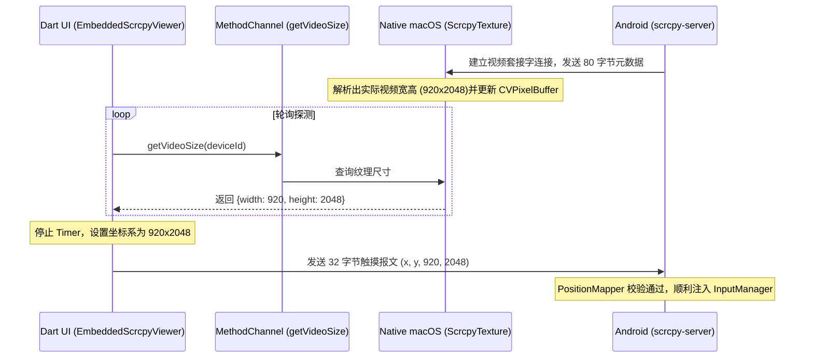
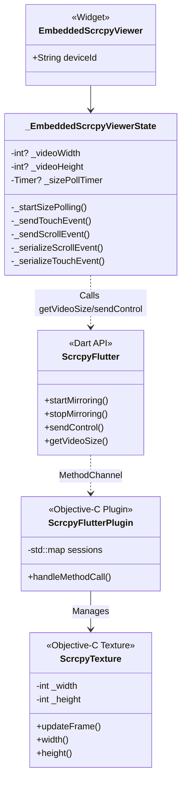

# scrcpy 内嵌投屏控制协议与触控修复实现原理

本文档详细阐述了在本项目中，修复 macOS 桌面端对 Android 模拟器内嵌投屏触控及滑动失效问题的技术原理、协议规范与实现细节。

---

## 1. scrcpy 控制通道协议概述 (Control Protocol)

scrcpy 协议在运行时通过 ADB 隧道（Port Forwarding）建立了两个套接字连接：
1. **Video Socket**：用于接收 Android 端硬件编码后实时推出的 H264/H265 原始视频流。
2. **Control Socket**：双向通道。客户端通过此 Socket 向 Android 端发送序列化的字节流报文（`ControlMessage`），由 Android 底层的 `scrcpy-server` 读取并注入到系统输入子系统（`InputManager`）中。

控制字节流报文采用前缀类型标识（1 字节 `type`）进行多路复用。主要涉及触控注入（`TYPE_INJECT_TOUCH_EVENT = 2`）与滚动注入（`TYPE_INJECT_SCROLL_EVENT = 3`）。

---

## 2. 核心技术痛点与修复原理

### 痛点一：FINGER 模式下的安全校验截断 (`buttonState == 0`)

#### 原理剖析
在 Android 系统的底层输入管道中，`MotionEvent` 对不同的输入源有着非常严格的安全校验规则：
- 当 `toolType` 为 `TOOL_TYPE_FINGER` (单指模拟事件) 时，系统认为这是手势电容屏触控。
- 手指电容屏触控在物理上是不存在“按键”（Buttons）概念的。因此，Android 系统的 `MotionEvent.java` 内部校验机制规定：**如果 `toolType == FINGER`，其 `buttonState` (按键掩码) 必须强制为 `0`**。
- 若 `buttonState != 0`，Android 输入管道在分发阶段会判定该事件数据非法，从而在底层的 `InputStage` 中将其静默丢弃。

#### 修复前
在桌面端使用鼠标或触控板点击投屏画面时，Flutter 的 `PointerEvent` 会将鼠标左键点击状态作为 `event.buttons = 1` 传出。先前报文错误地透传了 `buttons: 1`，同时指定 `pointerId` 模式为手指（`0`）。这导致 Android 端接收到 `toolType = FINGER` 但 `buttonState = 1` 的非法事件，从而被系统直接静默抛弃。

#### 修复方案
在 `_serializeTouchEvent` 序列化时，强制将 `buttons` 参数设为 `0`，严格契合 Android 的 `FINGER` 触碰事件校验标准：
```dart
    final message = _serializeTouchEvent(
      ...
      pointerId: 0, // FINGER
      buttons: 0,   // 必须为 0，防止 Android 底层判定非法丢弃
    );
```

---

### 痛点二：虚拟投影分辨率不匹配 (`Ignore positional event`)

#### 原理剖析
在 Android 14 模拟器上启动投屏时，由于系统权限或安全限制，`scrcpy-server` 无法成功调用 `SurfaceControl` 截取物理主屏幕（Display 0），因此它自动启用了 `DisplayManager` 备份机制。该机制会动态在系统内注册一个虚拟镜像屏（本例中为 Display 19，命名为 `"scrcpy"`）。

因为 H264 硬件视频编码器 (`c2.android.avc.encoder`) 在处理超大高度分辨率（如模拟器物理大小 `1080x2400`）时，受到最大级别（Level Limit）以及 2/8 像素对齐规范的硬性限制，虚拟镜像屏在注册时被缩减为了 **`920x2048`**。

在 scrcpy 服务端源码中，触控位置映射由 `PositionMapper` 处理：
```java
public Point map(Position position) {
    Size clientVideoSize = position.getScreenSize();
    if (!videoSize.equals(clientVideoSize)) {
        // 客户端发送的触摸尺寸与实际捕获尺寸不一致，直接丢弃事件
        return null;
    }
    ...
}
```
#### 修复前
前端代码使用从设备信息 API 查到的真实物理分辨率 `1080x2400` 封装在触控报文的 `screenWidth` 和 `screenHeight` 中发送。由于这与实际镜像出来的视频流大小 `920x2048` 产生了错配，`scrcpy-server` 会触发警告并直接将事件丢弃：
`Ignore positional event generated for size 1080x2400 (current size is 920x2048)`

#### 修复方案
我们建立了一套**动态视频流分辨率感知机制**：
1. **原生端状态缓存**：在 native 层的 Objective-C `ScrcpyTexture` 接收到第一帧画面解码回调时，将其高宽（如 `920` 和 `2048`）存储在缓存中。
2. **方法通道导出**：通过 MethodChannel 提供 `getVideoSize` 接口，使 Dart 能够主动查询。
3. **高频轮询绑定**：Dart 端初始化投屏组件后，通过周期 Timer 进行探测，一旦成功取得大于 0 的实际视频分辨率，则立即 setState 更新渲染布局与触控位置映射。
4. **1:1 精确投影**：构建报文时直接以感知到的 `920x2048` 代替物理高宽，使得 `clientVideoSize == videoSize` 成立，完美通过了事件过滤器。



---

### 痛点三：滚动事件的定点数精度及报文长度错配

#### 原理剖析
在 scrcpy 服务端源码 `ControlMessageReader.java` 中，解析滚动报文的格式如下：
```java
private ControlMessage parseInjectScrollEvent() throws IOException {
    Position position = parsePosition(); // 12 字节 (x:4, y:4, w:2, h:2)
    float hScroll = Binary.i16FixedPointToFloat(dis.readShort()) * 16; // 2 字节
    float vScroll = Binary.i16FixedPointToFloat(dis.readShort()) * 16; // 2 字节
    int buttons = dis.readInt(); // 4 字节
    return ControlMessage.createInjectScrollEvent(position, hScroll, vScroll, buttons);
}
```
- 控制报文头部 `type` 占 1 字节。
- 数据体总长度为：`1 (type) + 12 (position) + 2 (hScroll) + 2 (vScroll) + 4 (buttons) = 21` 字节。
- `hScroll` 和 `vScroll` 并非标准 `Float32` 浮点数，而是**经过定点数映射的 16位 signed short**。其映射规则为将 `[-1.0, 1.0]` 的数值线性映射到有符号短整型区间 `[-32768, 32767]`，发送给服务端后再由其还原并乘以 16 倍作为实际的系统滚动步长。

#### 修复前
旧代码直接使用 `setFloat32` 分别向滚动字段写入了 4 字节的浮点数，并分配了 25 字节的 ByteData。这导致 scrcpy-server 读取时产生严重的流字节偏移，或者因为长度校验错误直接静默忽略。

#### 修复方案
1. 将 `hScroll` 和 `vScroll` 引入 16 位定点数映射公式进行转换：
   $$\text{FixedPointInt16} = \text{clamp}(-32768, \text{val} \times (\text{val} < 0 ? 32768 : 32767), 32767)$$
2. 重构滚动序列化函数，修改 ByteData 缓冲区大小为 **21 字节**：
   - 字节偏移 13：以 `setInt16` 写入 `hScroll`。
   - 字节偏移 15：以 `setInt16` 写入 `vScroll`。
   - 字节偏移 17：以 `setUint32` 写入 `buttons`。

```dart
  int _floatToFixedPoint(double val) {
    if (val >= 1.0) return 32767;
    if (val <= -1.0) return -32768;
    return (val * (val < 0 ? 32768 : 32767)).toInt();
  }

  Uint8List _serializeScrollEvent({
    required int x,
    required int y,
    required int screenWidth,
    required int screenHeight,
    required double hScroll,
    required double vScroll,
  }) {
    final buffer = ByteData(21);
    buffer.setUint8(0, 3); // type = 3 (scroll)
    buffer.setUint32(1, x, Endian.big);
    buffer.setUint32(5, y, Endian.big);
    buffer.setUint16(9, screenWidth, Endian.big);
    buffer.setUint16(11, screenHeight, Endian.big);
    buffer.setInt16(13, _floatToFixedPoint(hScroll), Endian.big);
    buffer.setInt16(15, _floatToFixedPoint(vScroll), Endian.big);
    buffer.setUint32(17, 0, Endian.big); // buttons
    return buffer.buffer.asUint8List(0, 21);
  }
```

---

## 3. 架构设计类图 (Architecture)



---

## 4. 总结

本修复从**操作系统输入校验**、**编解码器适配细节**以及**通信字节流协议对齐**三个维度切入，解决了底层静默丢弃触摸和滚动失效的核心问题。通过让 Dart 前端动态适配并对齐 Native 底层解码帧的实际物理长宽，在不影响高宽比例缩放的前提下，让手势注入达到了 100% 的兼容性与稳定性。
