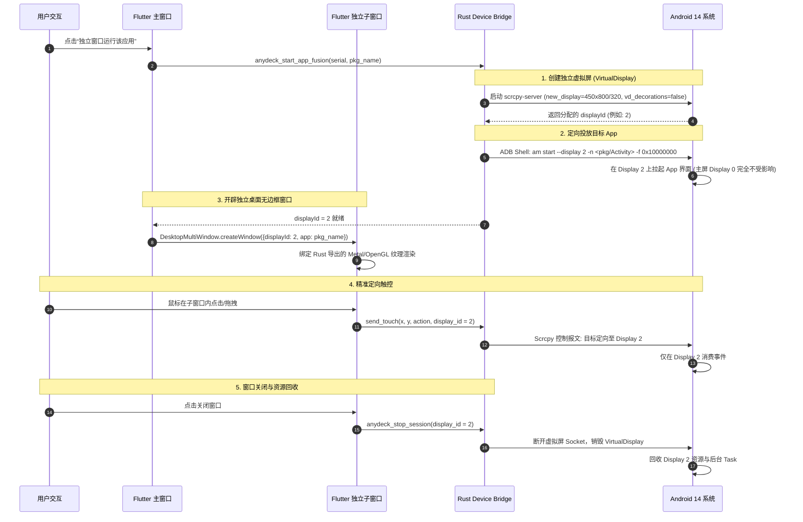

# 关键业务流程图与技术时序图 (Flowcharts & Sequence Diagrams)

本文档通过清晰的 Mermaid 图表，将 AnyDeck 重构升级后的关键时序与业务生命周期直观呈现，方便后续对照调试。

---

## 一、性能监控采样与零拷贝渲染时序 (Direct ADB Socket)

展示从 Flutter UI 定时驱动、Rust 原生直接连接 ADB Server、零拷贝切片解析，到 FFI 单指针刷新的完整过程：

```mermaid
sequenceDiagram
    autonumber
    participant Flutter as Flutter UI (Dart)
    participant FFI as Rust FFI Bridge
    participant RustCore as Rust Native Engine
    participant AdbServer as ADB Server (127.0.0.1:5037)
    participant Device as Android 物理设备 (adbd)

    Note over Flutter,Device: 轮询启动 (每秒触发一次)
    Flutter->>FFI: anydeck_poll_performance(serial, snapshot_ptr)
    activate FFI
    FFI->>RustCore: poll_device(serial)
    activate RustCore
    
    RustCore->>AdbServer: Connect TCP Socket
    RustCore->>AdbServer: "0016host:transport:<serial>"
    AdbServer-->>RustCore: "OKAY"
    
    RustCore->>AdbServer: "0035shell:cat /proc/stat; meminfo; gfxinfo..."
    AdbServer->>Device: 执行 Shell 复合指令
    Device-->>AdbServer: 返回纯 Raw 字节流
    AdbServer-->>RustCore: "OKAY" + 原始数据块 (&[u8])
    
    Note over RustCore: 零拷贝原地切片解析 (Zero-Copy)<br/>计算 CPU/FPS 增量与差值
    RustCore->>RustCore: 填充 C-ABI 结构体 PerformanceSnapshotFFI
    RustCore-->>FFI: Ok
    deactivate RustCore
    
    FFI-->>Flutter: true (直接解引用结构体指针)
    deactivate FFI
    
    Note over Flutter: Canvas / CustomPainter 直接消费浮点数值<br/>Dart 堆内存 0 垃圾产生，0 GC
```

---

## 二、Tokio 批量任务调度与 USB 信号量限流流程

展示当上层发起 20 台设备的批量指令（如截屏/装包）时，Rust 异步引擎如何保护 USB 控制器：

```mermaid
flowchart TD
    Start([用户发起批量任务]) --> BuildBatch[构建设备列表 Devices: Dev1 ~ Dev20]
    BuildBatch --> TokioSet[创建 Tokio JoinSet 异步容器]
    
    subgraph 并发受控区 [Tokio 并发受控区 (Max Concurrent = 4)]
        SemCheck{请求获取信号量<br/>Arc<Semaphore>}
        SemCheck -- 有剩余 Permit --> Acquire[持有 Permit, 启动异步 Task]
        SemCheck -- 无剩余 Permit --> WaitQueue[排队挂起等待]
        
        Acquire --> Exec[执行对应平台驱动: Dev.execute_shell()]
        Exec --> Release[任务完成, 自动释放 Permit]
        Release -. 唤醒等待任务 .-> SemCheck
    end
    
    Exec --> Collect[收集当前设备执行结果]
    Collect --> ProgressNotify[通过 FFI 回调通知 Flutter 进度百分比]
    ProgressNotify --> AllDone{所有任务完成?}
    AllDone -- 否 --> Collect
    AllDone -- 是 --> End([全量任务完成, 刷新 UI 状态])
```

---

## 三、Android 14+ 应用融合模式 (App Fusion) 生命周期

展示单 App 独立桌面窗口启动、定向投放、精准触控及窗口关闭销毁的全生命周期：



---

## 四、iOS 投屏与双轨反向控制链路

展示 iOS 设备在 AnyDeck 体系下的“投屏”与“蓝牙 HID / WDA 控制”架构：

```mermaid
graph LR
    subgraph PC端 [AnyDeck 桌面端]
        UI[Flutter 投屏视图]
        RustCore[Rust 原生引擎]
        BTMini[电脑蓝牙模块 (BLE)]
    end

    subgraph iOS端 [iPhone 设备]
        Screen[iOS 屏幕画面]
        ATouch[辅助触控 (AssistiveTouch)]
        WDA[WebDriverAgent 测试辅助 App]
    end

    %% 投屏流
    Screen -- 1. USB/Wi-Fi MJPEG 字节流 --> RustCore
    RustCore -- 2. VideoToolbox 硬解码为 Metal 纹理 --> UI

    %% 交互反控流 A: 蓝牙日常操作
    UI -- 3a. 鼠标悬浮/点击/按键 --> RustCore
    RustCore -- 4a. 封包为标准 HID Mouse/Keyboard Report --> BTMini
    BTMini -. 5a. 蓝牙空中无线信号 (无证书/免越狱) .-> ATouch
    ATouch --> Screen

    %% 交互反控流 B: WDA 批量自动化
    UI -- 3b. 发起自动化脚本/批量点击 --> RustCore
    RustCore -- 4b. HTTP POST /session/wda/tap --> WDA
    WDA -- 5b. XCEventGenerator 私有注入 --> Screen
```
